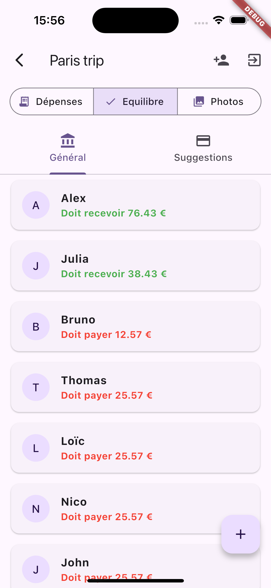

# Tricount - Expense Sharing App

A Flutter application for managing shared expenses between friends, roommates, or any group. Built with Flutter and Firebase.

## Screenshots

  
  
  
  
  
  
  
  
  
  
  
  
  
  
  

## Features

### Authentication
- Email/password authentication
- User profile management
- Secure Firebase authentication integration
- Automatic session management

### User Profile
- Customizable display name
- Profile picture support
- Friend management system
- View and manage personal expenses

### Friends Management
- Send friend requests
- Accept/reject incoming friend requests
- View friend list
- Remove friends
- Real-time friend request notifications

### Tricount Groups
- Create expense sharing groups
- Invite friends to groups
- Accept/reject group invitations
- Leave groups
- Real-time group updates

### Expense Management
- Add new expenses with:
  - Description
  - Amount
  - Payer
  - Date
  - Multiple participants
- View expense history
- Sort expenses by date
- Filter expenses by participant
- Real-time expense updates

### Expense justification
- Add image of the expense
- See the justification in Image section
- See the justification in expense detail

### Balance Calculation
- Automatic balance calculation for all participants
- View individual balances
- See who owes what to whom
- Smart debt simplification algorithm
- Two view modes:
  1. General overview (total balances)
  2. Detailed payment suggestions

### Multi-language Support
- Implementation i18n

### Real-time Updates
- Live updates for:
  - Expenses
  - Balances
  - Friend requests
  - Group invitations
  - Member changes

### Navigation
- Bottom navigation bar for easy access to:
  - Tricounts list
  - Notifications/Requests
  - Profile

### UI/UX Features
- Material Design 3
- Responsive layout
- Loading indicators
- Error messages
- Confirmation dialogs
- Cross-platform support (iOS, Android)

## Technical Details

### Firebase Integration
- Cloud Firestore for data storage
- Firebase Authentication
- Real-time listeners
- Batch operations for data consistency

### State Management
- StreamBuilder for real-time updates
- Efficient data caching
- Optimistic UI updates

### Code Organization
- Feature-based architecture
- Separate service layer
- Reusable widgets
- Localization support
- Clean code principles

## Installation

1. Clone the repository
2. Configure Firebase
3. Run `flutter pub get`
4. Update Firebase configuration files
5. Run the app with `flutter run`

## Dependencies
- firebase_core
- firebase_auth
- cloud_firestore
- flutter_localizations
- (other dependencies in pubspec.yaml)
